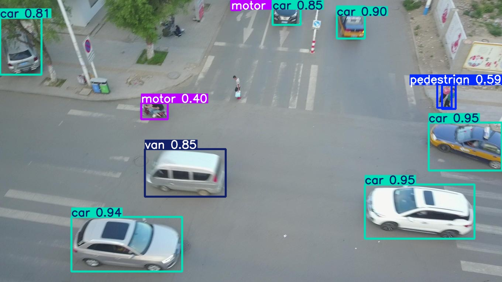
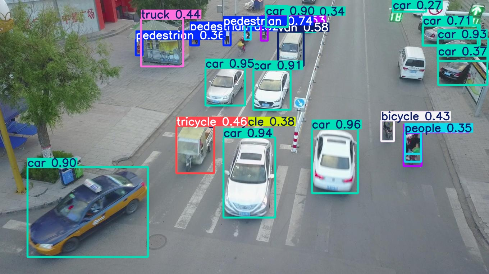

# VisDrone Object Detection з YOLO26

Цей проект призначений для навчання та запуску моделей штучного інтелекту сімейства YOLO (зокрема, **YOLO26**) на офіційному датасеті **VisDrone (Task 1: Object Detection in Images)**. 

Проект є повністю автономним GitHub-репозиторієм та оптимізований для розробки, навчання та тестування нативно на **macOS (Apple Silicon, 16GB RAM)** або через **Docker** на серверах **Linux / WSL2 (Nvidia CUDA)**. Усі дані, конфіги та результати зберігаються в межах робочої папки проекту.

---

## 📂 Структура репозиторію після розгортання

Після виконання кроків інструкції ваш проект автоматично набуде такого вигляду:

```text
/
├── assets/                     # GIF-анімації зразків роботи для GitHub
├── data/
│   ├── visdrone.yaml           # Локальний конфіг датасету
│   └── datasets/               # Локальний важкий датасет (ігнорується Git)
│       └── VisDrone/
│           ├── images/         # Зображення (train / val / test-dev)
│           └── labels/         # Сконвертовані .txt файли YOLO
├── runs/                       # Результати навчання, аналітика та ваги best.pt
├── .gitignore                  # Ігнорування важких та системних файлів для Git
├── requirements.txt            # Зафіксовані залежності проекту
├── inference_image.py          # Скрипт детекції об'єктів на фото
├── inference_video.py          # Скрипт обробки послідовностей кадрів у MP4 з телеметрією
└── README.md                   # Цей файл інструкцій
```

---

## 🚀 Крок 1. Створення середовища та інсталяція пакетів

Перш ніж запускати скрипт підготовки даних, необхідно налаштувати ізольоване оточення та встановити залежності.

### 1. Налаштування віртуального середовища (`pyenv`)
Для повної сумісності використовується [Simple Python version management](https://github.com/pyenv) версія Python 3.12.3, яка відповідає офіційному Docker-іміджу [ultralytics/ultralytics:8.4.96-python](https://hub.docker.com/layers/ultralytics/ultralytics/8.4.96-python/images/sha256-8160e28b634f1a63e48b4e1b256d243d91d405ca5bc9e7da33512ad106137792).

```bash
pyenv install 3.12.3
pyenv virtualenv 3.12.3 visdrone-env
pyenv local visdrone-env
```


### 2. Інсталяція зафіксованих залежностей
Оновлюємо інструменти збірки до версій образу, після чого ставимо пакети з файлу:
```bash
pip install wheel==0.47.0 setuptools==83.0.0 pip==24.0
pip install -r requirements.txt
```

---

## 🛠️ Крок 2. Автоматичне завантаження та підготовка датасету

Щоб змусити вбудований завантажувач Ultralytics викачати та розпакувати датасет всередині нашого репозиторію (а не рівнем вище), ми примусово перевизначимо системну змінну `datasets_dir` прямо під час виклику.

Запустіть цю команду у Терміналі:
```bash
python -c "import os; from ultralytics import settings; settings.update({'datasets_dir': os.path.join(os.getcwd(), 'data/datasets')}); from ultralytics.data.utils import check_det_dataset; check_det_dataset('VisDrone.yaml')"
```

### Що зробить ця команда автоматично:
1. Перепише глобальний шлях завантаження на внутрішню теку репозиторію: `data/datasets/`.
2. Знайде актуальні дзеркала, викачає гігабайтні оригінальні архіви та розпакує їх.
3. Проведе автоматичну конвертацію розмітки з оригінальних пікселів у нормалізований формат YOLO (від 0.0 до 1.0).

---

## 🍏 Крок 3. Нативний запуск навчання на macOS (Apple Silicon, 16GB RAM)

Локальний запуск на Mac забезпечує максимальну швидкість обчислень завдяки використанню графічного ядра чіпа Apple M через **MPS (Metal Performance Shaders)**. 

⚠️ **Важливо для конфігурації з 16GB RAM:** Через ліміти об'єму оперативної пам'яті використання параметрів `cache=True` (вимагає 7.2+ ГБ вільної RAM) або `cache=disk` (створює велике навантаження на Swap-файл) призводить до переповнення RAM та падіння швидкості. Оптимальним рішенням для стабільної роботи є встановлення **`batch=8`** та **`cache=False`**.

Запустіть навчання на 10 епох:
```bash
yolo detect train data=data/visdrone.yaml model=yolo26n.pt epochs=10 imgsz=640 batch=8 cache=False patience=5 device=mps project=local name=visdrone plots=False deterministic=False
```
*(Примітка: Перша епоха займає трохи більше часу через процес компіляції Metal-шейдерів. Починаючи з 2-ї епохи, швидкість стабілізується на максимумі, а час епохи складатиме всього близько 5.5 хвилин, споживаючи безпечні ~11 ГБ пам'яті).*

---

## 📋 Опис параметрів команди тренування

* **`yolo detect train`** — Головний виклик CLI Ultralytics. Визначає ШІ-задачу як `detect` (детекція об'єктів за допомогою обмежувальних рамок) та режим `train` (навчання).
* **`data=data/visdrone.yaml`** — Шлях до конфігураційного файлу датасету. Вказує моделі розташування зображень і текстові мітки для 10 цільових класів.
* **`model=yolo26n.pt`** — Архітектура моделі `yolo26n` (YOLO26 Nano). Підключає попередньо навчені ваги для активації техніки *Transfer Learning*.
* **`epochs=10`** — Кількість повних циклів навчання. Налаштовано на швидкий та стабільний фінальний забіг для коригування ваг.
* **`imgsz=640`** — Роздільна здатність вхідних даних. Усі зображення автоматично масштабуються до базового квадрата 640x640 пікселів.
* **`batch=8`** — Розмір пакета даних. Знижує споживання `GPU_mem`, захищаючи 16-гігабайтний Mac від переходу в повільний режим Swap.
* **`cache=False`** — Вимикає тримання розпакованих картинок в ОЗП або на диску. Забезпечує максимальну стабільність обчислень на Mac з 16GB RAM.
* **`patience=5`** — Стратегія ранньої зупинки тренування (*Early Stopping*). Якщо протягом 5 епох поспіль точність не покращується, процес завершиться автоматично.
* **`device=mps`** — Вказує PyTorch перенаправляти всі обчислення на графічні ядра Apple Silicon за допомогою апаратного прискорювача *Metal Performance Shaders*.
* **`project=local`** — Базова коренева директорія для автоматичного збереження логів та ваг моделей.
* **`name=visdrone`** — Назва підпапки для поточного тренувального сеансу.
* **`plots=False`** — Вимикає генерацію та запис на диск графіків після кожної епохи, суттєво прискорюючи час тренування на Mac за рахунок економії I/O-операцій диска.
* **`deterministic=False`** — Вимикає обмеження на використання лише детерміністичних алгоритмів, дозволяючи графічному чіпу Apple M працювати у максимальному асинхронному режимі.

---

## 🔍 Крок 4. Запуск розпізнавання та підрахунку (Inference)

Після завершення навчання ви можете запустити скрипт **`inference_image.py`**, який автоматично підтягне найкращі ваги `best.pt`, підрахує кількість знайдених машин та пішоходів і збереже візуальний результат з рамками класів на диск у теку `runs/detect/predict_images/`.

### 1. Де взяти тестові матеріали?
* **Готові фото:** У вашому репозиторії вже є сотні валідаційних фотографій. Вони лежать у папці: `data/datasets/VisDrone/images/val/`.
* **Офіційні набори даних (фото та відео):** Завантажити додаткові матеріали, тестові послідовності та розмітку можна безпосередньо з офіційної сторінки репозиторію [VisDrone Dataset](https://github.com/VisDrone/VisDrone-Dataset#task-1-object-detection-in-images).

Перемістіть завантажений файл `VisDrone2019-VID-val.zip` у корінь вашого проекту (`visdrone-yolov8-detection/`), відкрийте Термінал і виконайте ці три швидкі команди:
```bash
# 1. Створюємо правильну локальну папку для відео всередині датасету
mkdir -p data/datasets/VisDrone/videos

# 2. Розпаковуємо ваш архів безпосередньо у цю папку
unzip VisDrone2019-VID-val.zip -d data/datasets/VisDrone/videos

# 3. Видаляємо тимчасовий zip-файл з кореня репозиторію, щоб звільнити місце
rm VisDrone2019-VID-val.zip
```

### 2. Команда для запуска тестування зображень
```bash
python inference_image.py
```

### 3. Обробка послідовностей кадрів у відео MP4
Скрипт **`inference_video.py`** обробляє папки з послідовними кадрами з дрона, виконує детекцію та об'єднує їх у фінальний відеоролик `.mp4` з накладанням динамічної телеметрії в реальному часі (кількість машин та пішоходів у лівому верхньому куті).

Команда для запуску:
```bash
python inference_video.py
```
*(Шлях до теки з кадрами можна налаштувати у змінній `target_sequence_folder` наприкінці файлу.)*

---

## 🎬 Демонстрація роботи (Зразки детекції)

Нижче наведено приклади детекції та підрахунку автомобілів і пішоходів у реальному часі на відеопослідовностях з набору VisDrone:

| Приклад 1 | Приклад 2 |
| --- | --- |
|  |  |

| Приклад 3 | Приклад 4 |
| --- | --- |
|  |  |

### Приклади детекції на статичних зображеннях (фото):

| Приклад 5 | Приклад 6 |
| --- | --- |
|  |  |

---

## 🌐 Крок 5. Запуск в Docker (Чистий оригінальний образ)

Цей підхід ідеальний для перенесення важкого довгого тренування на віддалені Linux-сервери чи у **WSL2 (Nvidia CUDA)**.

### ⚠️ Критично важливе правило для збереження результатів (`--rm`)
Щоб результати та ваги `best.pt` **нативно зберігалися у вашій локальній папці проекту на Mac/ПК**, обов'язково прокидайте поточну директорію через `-v`, встановлюйте робочу зону через `-w` та вказуйте параметри YOLO `project` і `name`.

#### Варіант 1. Запуск у Linux / WSL2 з підтримкою Nvidia GPU (CUDA)
```bash
docker run --gpus all --rm -it \
  -v "$(pwd)":/usr/src/app \
  -w /usr/src/app \
  ultralytics/ultralytics:8.4.96-python \
  yolo detect train data=data/visdrone.yaml model=yolo26n.pt epochs=50 imgsz=640 batch=64 device=0 deterministic=False plots=False project=/usr/src/app/runs/detect name=visdrone_yolo26_linux
```

#### Варіант 2. Тестовий запуск на macOS (Виключно на CPU для налагодження коду)
```bash
docker run --rm -it \
  -v "$(pwd)":/usr/src/app \
  -w /usr/src/app \
  ultralytics/ultralytics:8.4.96-arm64 \
  yolo detect train data=data/visdrone.yaml model=yolo26n.pt epochs=1 imgsz=640 batch=4 device=cpu deterministic=False plots=False project=/usr/src/app/runs/detect name=visdrone_yolo26_mac_cpu
```

---

## 🎯 Специфікація класів датасету VisDrone
У конфігурації зафіксовано 10 офіційних категорій об'єктів (ігноровані зони та клас "інші" автоматично відфільтровані під час підготовки):

* **0:** pedestrian (пішохід)
* **1:** people (група людей)
* **2:** bicycle (велосипед)
* **3:** car (автомобіль)
* **4:** van (фургон)
* **5:** truck (вантажівка)
* **6:** tricycle (триколісний велосипед)
* **7:** awning-tricycle (критий триколісний транспорт)
* **8:** bus (автобус)
* **9:** motor (мотоцикл)

---

## 🔗 Original Project

> **[artbutyrin/visdrone-yolov8-detection](https://github.com/artbutyrin/visdrone-yolov8-detection)**
